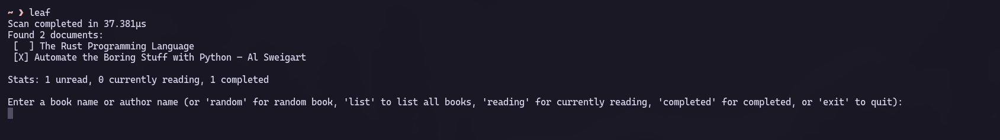
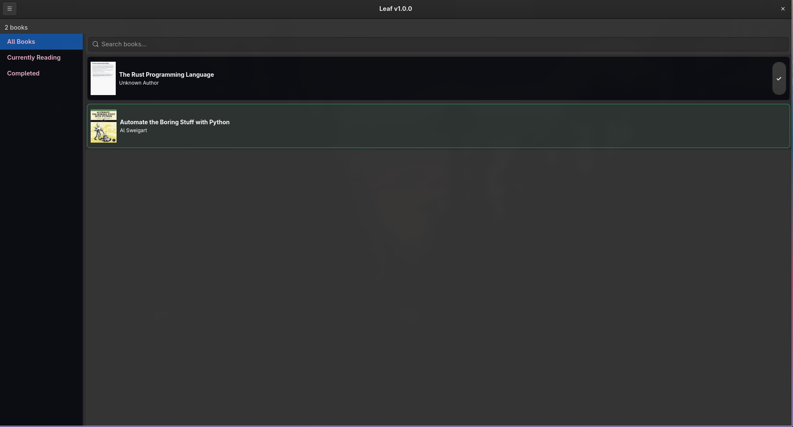

Leaf is a free and open-source personal e-book library manager for Linux, written in Rust. It scans your library for PDF and EPUB files, extracts metadata and cover images, and lets you browse, search, and track your reading progress. If you have an e-book library and wish to be able to track your reading faster, this is it!

Leaf does **not** distribute, link to, or endorse any copyrighted content. It is purely a management tool for your own local files — nothing is downloaded, shared, or fetched from external sources.

**Features**

- CLI (`leaf`) and GTK4 GUI (`leaf --gui`)
- Fuzzy search with typo tolerance and acronym matching, as well as search by author
- Reading status tracking (Unread/Currently Reading/Completed)
- Automatic metadata and cover extraction to a file to speed up loading times
- Random book picker (exclusive to CLI as a little bonus!)
- Automatic opening of the OS' native document viewer for immediate reading




**Dependencies**

The install script handles these automatically for supported distros (see below).

- `rustc` and `cargo` to build (install via [rustup.rs](https://rustup.rs))
- `gtk4` development headers (includes pango, gdk-pixbuf, cairo) for the GUI toolkit
- `pdftoppm` for PDF cover generation (poppler-utils on most distros)

Supported distros and the packages the script will install:

| Distro | Command |
|--------|---------|
| Arch or Arch derivative (EndeavourOS, CachyOS, Manjaro, etc.) | `sudo pacman -S --needed gtk4 poppler` |
| Debian, Ubuntu, or derivative (Pop!_OS, Linux Mint, Zorin, etc.) | `sudo apt install libgtk-4-dev poppler-utils` |
| Fedora or Fedora derivative | `sudo dnf install gtk4-devel poppler-utils` |
| openSUSE (Tumbleweed, Leap) | `sudo zypper install gtk4-devel poppler-tools` |

If your distro is not listed, the script will prompt you to install the dependencies manually before continuing.

**Install**

```sh
git clone https://codeberg.org/KarloKomsic/leaf.git
cd leaf
cargo build --release
./install.sh           # user install (~/.local)
sudo ./install.sh system  # system-wide install (/usr/local)
```

To uninstall: `./install.sh uninstall`

**Usage**

If you intend on running the application via the GUI (Graphical User Interface), you may simply go over to your app launcher of choice and launch the application from there, OR from the terminal, type in `leaf --gui`. 

For you terminal enjoyers out there (like myself), there is a CLI version of the application available. To launch it, simply go to your preferred terminal emulator and type in `leaf`.

